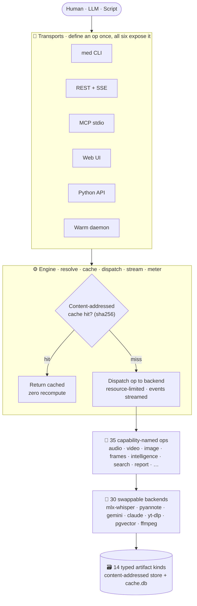

<div align="center">

# 🎛️ media_engine

### Turn any media — video, audio, images, documents, web pages — into typed, cached, queryable artifacts.

[](https://github.com/pedrodinis/media_engine/actions/workflows/ci.yml)
[](LICENSE)
[](pyproject.toml)
[](pyproject.toml)

**One operation model** exposed through **six transports** · **pluggable local-or-cloud backends** · **content-addressed caching** that never recomputes what it has already seen · an **async DAG executor** that streams progress and meters cost.

</div>

---

You describe **what** you want — `audio.transcribe`, `video.comprehend`, `intelligence.summarize` — and the engine handles **how**: it picks a backend, caches every result by content hash, streams progress over SSE, tracks cost, enforces resource limits, and composes operations into a dependency graph. The engine itself holds **zero domain opinions** — no hardcoded speaker schemas, no sentiment dimensions; those live in swappable *profiles* that are data, not code.

Add one operation and it lights up across the **CLI, REST API, MCP server, Python API, warm daemon, and web UI** — automatically.

```bash
git clone https://github.com/pedrodinis/media_engine.git && cd media_engine
uv sync
uv run med acquire-url "https://youtu.be/…" --quality 360p    # ingest anything
uv run med run video.comprehend --input <video-id>            # VLM + diarized transcript → one LLM synthesis
uv run med web start --open                                   # or drive it all from a browser
```

## 🗺️ Architecture at a glance



*Every artifact carries a sha256 id derived from its inputs, so re-running a pipeline with one changed parameter recomputes only the affected sub-graph — everything upstream is a cache hit.*

## ✨ What it can do

**35 capability-named operations** across 15 groups — each one swappable, cacheable, and exposed on every transport:

| | Group | Operations |
|:--:|---|---|
| 🎬 | **Acquire** | `upload` local files · `url` (yt-dlp / playwright) · `livestream` recorder |
| 🎙️ | **Audio** | `transcribe` · `diarize` · `transcribe_diarized` · `detect_language` |
| 🎞️ | **Video** | `extract_audio` · `sample_frames` · `trim` · `multimodal` · `comprehend` |
| 🖼️ | **Image** | `classify` · `describe` · `ocr` |
| 🔲 | **Frames** | `analyze` · `compare` · `subsample` |
| 📄 | **Document** | `parse` (PDF → text via pymupdf) |
| 🌐 | **Web** | `fetch` · `metadata.scrape_page` |
| 📝 | **Transcript** | `parse` (srt / vtt / speakered) · `merge` |
| ✂️ | **Chunk** | `semantic` (sentence-boundary chunking) |
| 🧮 | **Embed** | `text` (sentence-transformers) |
| 🧠 | **Intelligence** | `extract` · `summarize` · `classify` · `analyze` |
| 🔎 | **Search** | `fulltext` · `semantic` · `hybrid` (RRF fusion) |
| 🗣️ | **Speakers** | `identify` (name-DB fuzzy match) |
| 📊 | **Report** | `session` · `zeitgeist` (Jinja-templated) |

Plus **10 bundled profiles** (`profiles/`) — an `analysis-full` reference pipeline, five prompt-based lenses (`video-knowledge`, `technical-academic`, `diy-electronics`, `cooking-recipes`, `general-custom`), and four pipeline examples (`transcribe-and-diarize`, `url-to-summary`, `teams-meeting`, `video-comprehend`).

## 🧭 Why it's built this way

| Principle | What it buys you |
|---|---|
| 🏷️ **Capability-named ops** | `audio.transcribe`, never `mlx_whisper.transcribe`. Swap the implementation, keep the contract. |
| 🔗 **Content-addressed caching** | Every artifact has a sha256 id. Identical inputs never recompute — across runs, transports, and machines. |
| 🔌 **Swappable backends** | Same op, different provider. Local mlx-whisper on Apple Silicon ↔ cloud Gemini on Linux — one flag. |
| 📄 **Profiles are data** | Pipelines are YAML or markdown-with-frontmatter, not code. The engine stays domain-agnostic. |
| 🌊 **Streaming-first** | Every op emits `Progress` + `LogLine` events. Live RAM/ETA gauges and log tails come for free. |
| 🤖 **MCP-native** | Every op auto-exposes as an LLM tool. Point Claude at it and it can drive the whole engine. |
| 🕸️ **DAG, not pipeline** | Fan-out / fan-in with resource-aware parallelism (e.g. one VLM at a time on Apple Silicon). |
| 💰 **Cost-aware** | `op.cost_estimate()` everywhere; `--dry-run` prices the whole DAG before you spend a cent. |

## 📦 Install

```bash
uv sync                              # core + dev
uv sync --extra api --extra postgres # serve REST against postgres
uv sync --extra llm-mlx              # local LLM (mlx-lm) on Apple Silicon
uv sync --all-extras                 # everything
```

Optional-dependency extras keep the import surface lean and gate ML libraries behind explicit opt-in. See `pyproject.toml::optional-dependencies` for the full matrix, and run `med doctor` to see which ops work on your machine right now.

## ⏱️ 30-second tour

```bash
# What's available
uv run med ops                       # all 35 ops
uv run med profile ls                # 10 bundled profiles
uv run med config                    # effective config

# Ingest something
uv run med acquire <local-file>
uv run med acquire-url <youtube-or-direct-url> --quality 360p

# Run a profile end-to-end
uv run med profile run analysis-full --input <video-id>

# Run a single op
uv run med run audio.transcribe --input <audio-id> --param model=...

# Inspect what came out
uv run med ls                        # cache listing
uv run med lineage <artifact-id>     # upstream tree

# Operate
uv run med daemon start              # warm engine for fast reuse
uv run med api start                 # REST + SSE on :8000 (headless)
uv run med web start --open          # REST + SSE + /ui SPA, opens browser
uv run med mcp serve                 # MCP stdio for LLM clients

# Diagnose
uv run med doctor                    # which ops work on this machine?
uv run med doctor --op audio.        # deep view of one op family
```

Use `--help` on any subcommand for the full flag set, or see [`docs/cli_reference.md`](docs/cli_reference.md).

## 🖥️ Web UI


A SvelteKit single-page app is bundled at `/ui` and served by the same FastAPI process as the REST API — **full feature parity with the CLI**: ingest (upload / URL / livestream / batch), schema-driven run forms with live cost preview, a job dashboard with SSE updates, a catalog browser with per-kind preview affordances, a lineage graph viewer, sync search, a cost ledger with rollup bars + monthly burn projection, a profile workspace with a visual DAG composer + CodeMirror YAML editor + live compile + fork-this, and a settings panel (Doctor / Secrets / Extras / Backends / Visibility / Tokens / Storage / Config).

```bash
bash scripts/build_web.sh               # one-time, populates media_engine/web/dist/
uv run med api token create --label web-ui
uv run med web start --open
```

See [`docs/web_ui.md`](docs/web_ui.md) for the panel-by-panel tour, security posture, and the CLI ↔ UI parity matrix. A wheel install from PyPI ships the built dist tree by default — no Node toolchain needed on the host.

## 🧱 Adding your own

The engine is designed to be extended in minutes — a new op or backend is picked up by **all six transports** the moment you register it in `media_engine/bootstrap.py`.

- **Operation:** [`docs/adding_an_operation.md`](docs/adding_an_operation.md)
- **Backend:** [`docs/adding_a_backend.md`](docs/adding_a_backend.md)
- **Profile:** [`docs/writing_a_profile.md`](docs/writing_a_profile.md)

## 📚 Reference

- **Architecture (as-built):** [`docs/architecture.md`](docs/architecture.md)
- **CLI reference:** [`docs/cli_reference.md`](docs/cli_reference.md)
- **REST + MCP API reference:** [`docs/api_reference.md`](docs/api_reference.md)
- **Web UI guide:** [`docs/web_ui.md`](docs/web_ui.md) · v1.x backlog: [`docs/web_ui_deferred.md`](docs/web_ui_deferred.md)
- **Deployment (Docker / Helm / Terraform / Hetzner):** [`docs/deployment.md`](docs/deployment.md)
- **Bundled profile guide:** [`docs/profile_analysis_full.md`](docs/profile_analysis_full.md)
- **Changelog:** [`CHANGELOG.md`](CHANGELOG.md) · **License:** [MIT](LICENSE)

## 🚦 Status

**v0.7.0 (2026-05-26), Phase 6.7.** Two bundled shipments: live observability (every op emits a heartbeat with RAM + ETA every 2s; a Logs tab streams subprocess/logger output live in the Web UI) and **`video.comprehend`** — a composite op that fans out per-frame VLM calls, runs diarized transcription in parallel, and fuses both timelines into a single SOTA-LLM call. See [`CHANGELOG.md`](CHANGELOG.md) for the full per-release history.

**Quality bar:** 1033 passing tests (6 skipped / 24 deselected behind hardware-, API-key-, and external-tool-gated markers), `ruff` clean, `pyright --strict` clean, and a 70-test frontend suite (`svelte-check` 0/0 on 582 files). CI runs the same gate on every push. **35 ops · 30 backends · 14 artifact kinds · 6 transports.**

**Next — Phase 7:** acoustic speaker identity (`speakers.embed_voice` + `speakers.cluster` + `speakers.match`, a voice-fingerprint DB reusing the pgvector backend). See the roadmap in [`CLAUDE.md`](CLAUDE.md).

*Semver applies from v1.0 (once the REST surface freezes). Until then, 0.x bumps freely with best-effort backwards compatibility.*
