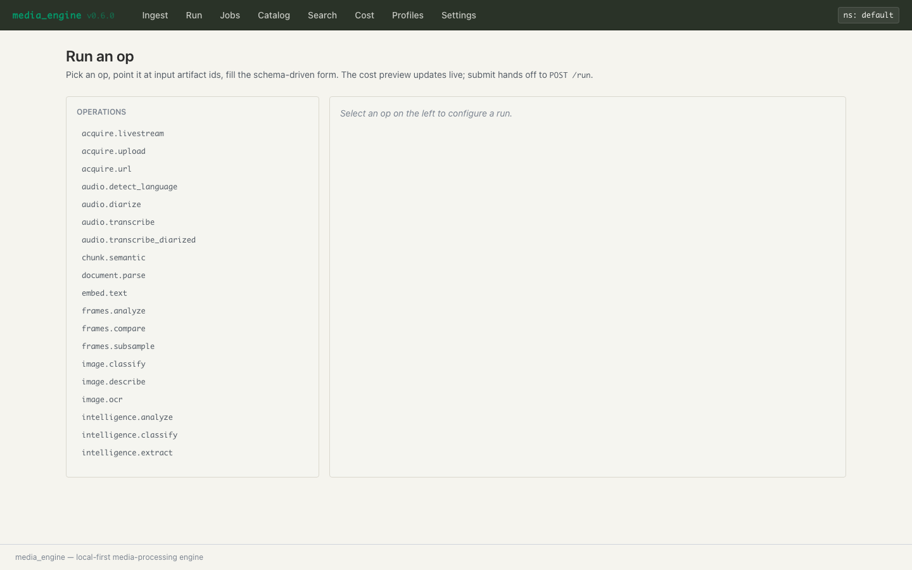

# media_engine

[](https://github.com/pedrodinis/media_engine/actions/workflows/ci.yml)
[](LICENSE)
[](pyproject.toml)

Universal media-processing engine. Typed artifacts, capability-named
operations, pluggable backends, content-addressed caching, async DAG
execution. Ships as a Python package + CLI (`med`) + daemon + REST +
MCP stdio server + local-first Web UI.

```bash
git clone https://github.com/pedrodinis/media_engine.git && cd media_engine
uv sync
uv run med ops                                    # 36 ops registered
uv run med profile ls                             # 10 bundled profiles
uv run med profile run analysis-full --input <video-id>

# Prefer a GUI?  (one-time: bash scripts/build_web.sh)
uv run med api token create --label web-ui
uv run med web start --open                       # opens /ui/setup
```

## What you get out of the box

- **36 capability-named ops** across `acquire.*`, `audio.*`, `video.*`,
  `image.*`, `frames.*`, `document.*`, `web.*`, `transcript.*`,
  `chunk.*`, `embed.*`, `intelligence.*`, `metadata.*`, `search.*`,
  `speakers.*`, and `report.*`.
- **30 backends** behind those ops: mlx-whisper, pyannote, yt-dlp,
  playwright, gemini, claude, mlx-lm, sentence-transformers, sqlite-fts5,
  pgvector / postgres-tsvector, ffmpeg-uniform, vllm-mlx, open-clip,
  rapidocr, pymupdf, …
- **10 bundled profiles** (see `profiles/`): an `analysis-full` reference
  pipeline, five `kind: prompt` lenses
  (`video-knowledge`, `technical-academic`, `diy-electronics`,
  `cooking-recipes`, `general-custom`), and four `kind: pipeline`
  examples (`transcribe-and-diarize`, `url-to-summary`,
  `teams-meeting`, `video-comprehend`).
- **Six transports** for every op: CLI, daemon, REST + SSE, MCP stdio,
  Python API, and a SvelteKit Web UI bundled at `/ui`. Adding an op or
  backend lights it up across all six automatically.

## Install

```bash
uv sync                              # core + dev
uv sync --extra api --extra postgres # serve REST against postgres
uv sync --extra llm-mlx              # local LLM (mlx-lm) on Apple Silicon
uv sync --all-extras                 # everything
```

Optional-dependency extras keep the import surface lean and gate ML
libraries behind explicit opt-in. See `pyproject.toml::optional-dependencies`
for the full matrix.

## 30-second tour

```bash
# What's available
uv run med ops                       # all 36 ops
uv run med profile ls                # 10 bundled profiles
uv run med config                    # effective config

# Ingest something
uv run med acquire <local-file>
uv run med acquire-url <youtube-or-direct-url> --quality 360p

# Run a profile end-to-end
uv run med profile run analysis-full --input <video-id>

# Run a single op
uv run med run audio.transcribe --input <audio-id> --param model=...

# Inspect what came out
uv run med ls                        # cache listing
uv run med lineage <artifact-id>     # upstream tree

# Operate
uv run med daemon start              # warm engine for fast reuse
uv run med api start                 # REST + SSE on :8000 (headless)
uv run med web start --open          # REST + SSE + /ui SPA, opens browser
uv run med mcp serve                 # MCP stdio for LLM clients

# Diagnose
uv run med doctor                    # which ops work on this machine?
uv run med doctor --op audio.        # deep view of one op family
```

Use `--help` on any subcommand for the full flag set, or see
[`docs/cli_reference.md`](docs/cli_reference.md).

## Web UI



A SvelteKit single-page app is bundled at `/ui` and served by the same
FastAPI process as the REST API. Full feature parity with the CLI:
ingest (upload / URL / livestream / batch), schema-driven run forms
with live cost preview, job dashboard with SSE updates, catalog browser
with per-kind preview affordances, lineage graph viewer, sync search,
cost ledger with rollup bars + monthly burn projection, profile
workspace with visual DAG composer + CodeMirror YAML editor + live
compile + fork-this for bundled profiles, and a six-tab settings
panel (Tokens / Backends / Plugins · Extras / Plugins · Catalog /
Storage / Config).

```bash
bash scripts/build_web.sh               # one-time, populates media_engine/web/dist/
uv run med api token create --label web-ui
uv run med web start --open
```

See [`docs/web_ui.md`](docs/web_ui.md) for the panel-by-panel tour,
security posture, and the CLI ↔ UI parity matrix. A wheel install
from PyPI ships the built dist tree by default — no Node toolchain
needed on the host.

## Adding your own

- **Op:** [`docs/adding_an_operation.md`](docs/adding_an_operation.md)
- **Backend:** [`docs/adding_a_backend.md`](docs/adding_a_backend.md)
- **Profile:** [`docs/writing_a_profile.md`](docs/writing_a_profile.md)

A new op or backend is picked up by all six transports the moment you
add it to `media_engine/bootstrap.py::_op_classes()` /
`_backend_classes()`.

## Reference

- **Architecture (as-built):** [`docs/architecture.md`](docs/architecture.md)
- **CLI reference:** [`docs/cli_reference.md`](docs/cli_reference.md)
- **REST + MCP API reference:** [`docs/api_reference.md`](docs/api_reference.md)
- **Web UI guide:** [`docs/web_ui.md`](docs/web_ui.md) · v1.x backlog:
  [`docs/web_ui_deferred.md`](docs/web_ui_deferred.md)
- **Deployment (Docker / Helm / Terraform):** [`docs/deployment.md`](docs/deployment.md)
- **Bundled profile guide:** [`docs/profile_analysis_full.md`](docs/profile_analysis_full.md)
- **Contributor orientation:** [`CLAUDE.md`](CLAUDE.md)
- **Changelog:** [`CHANGELOG.md`](CHANGELOG.md)
- **License:** [MIT](LICENSE)

## Status

**v0.7.0 shipped (2026-05-26), Phase 6.7.** Two bundled shipments:
live observability (every op emits a heartbeat with RAM + ETA every
2s; a new Logs tab streams subprocess/logger output live in the Web
UI) and **`video.comprehend`** — a composite op that fans out
per-frame VLM calls, runs diarized transcription in parallel, and
fuses both timelines into one SOTA-LLM call. See
[`CHANGELOG.md`](CHANGELOG.md) for the full per-release history
(Phase 6 → 6.7, `v0.6.0`–`v0.7.0`).

Suite: 1010 passed / 6 skipped / 24 deselected (hardware-, API-key-,
and external-tool-gated — see the `needs_*` markers in
`pyproject.toml`). Ruff + strict pyright clean. Frontend: 70 Vitest
unit tests, svelte-check 0/0 on 582 files. 36 ops, 30 backends, 14
artifact kinds. CI (`.github/workflows/ci.yml`) runs the same gate on
every push.

**Phase 7 — acoustic speaker identity** (`speakers.embed_voice` +
`speakers.cluster` + `speakers.match`, voice-fingerprint DB reusing
the pgvector backend) is queued next — see the roadmap in
[`CLAUDE.md`](CLAUDE.md).

v1.0 lands when the REST surface freezes (after Phase 6). Before then
semver stays 0.x; backwards compatibility is best-effort but not
contractual.
