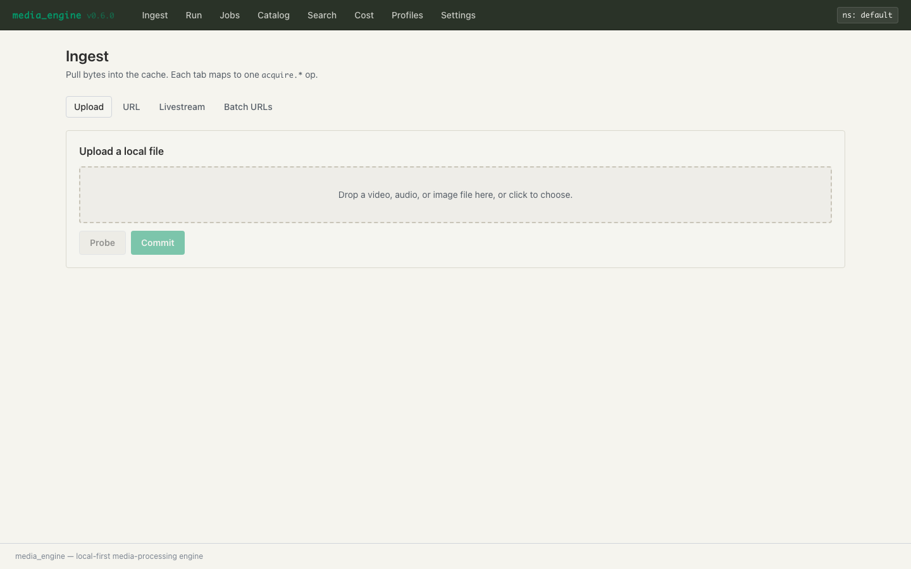
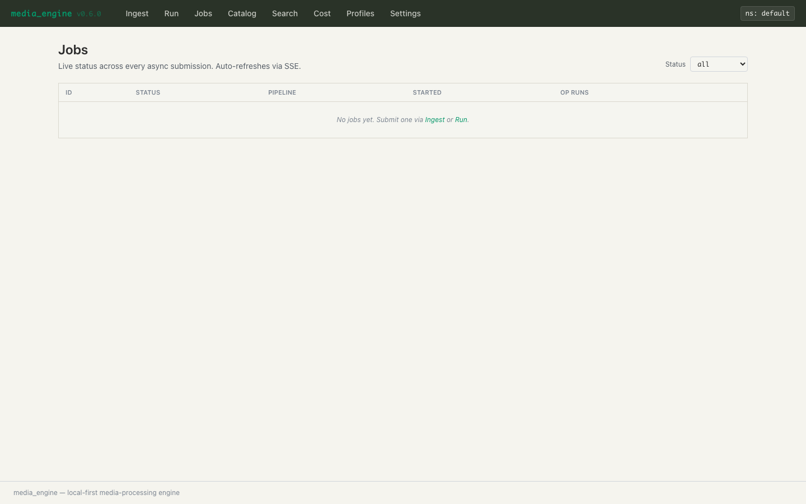
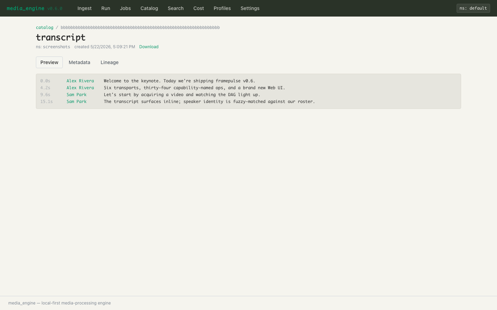
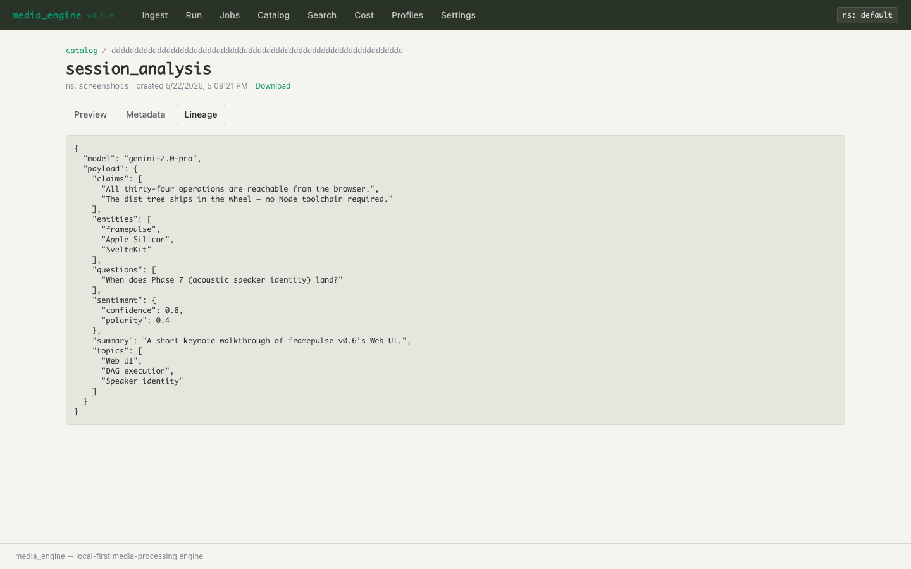
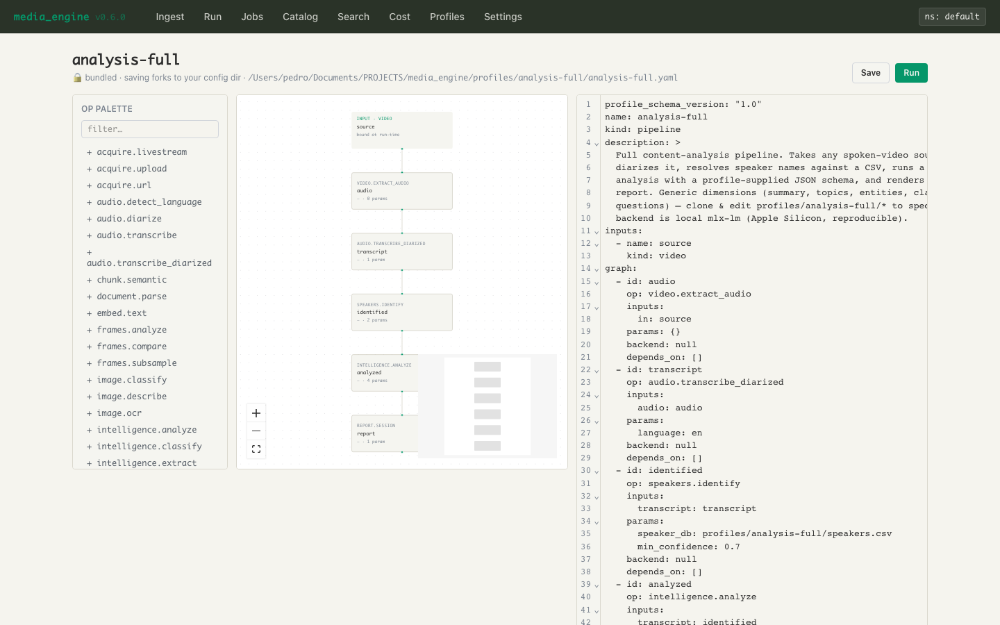

# Web UI — `med web start`

`media_engine`'s Web UI is a SvelteKit single-page app bundled in the
engine container at `/ui`, served by the same FastAPI process that
powers the REST API. The bar is *full GUI parity with the CLI*:
anything you can do with `med <verb>` you can do from the browser,
without dropping to a shell.

This guide is a feature tour of what ships in Phase 6 v0.6.0. For the
underlying REST surface see [`api_reference.md`](api_reference.md); for
the architectural rationale (mount model, paste-token bootstrap, SSE
auth) see [`architecture.md`](architecture.md) §11 + §12; for items
explicitly deferred to v1.x see [`web_ui_deferred.md`](web_ui_deferred.md).

> **Status — v0.6.0 (2026-05-22) — Phase 6 complete.** Twelve
> numbered commits (39–50) + three audit-fix passes (post-46, post-48,
> post-49) + two docs syncs landed in the release window. Every panel
> is live: Ingest, Run, Jobs, Catalog, Search, Cost, Lineage,
> **Profile workspace + examples library**, and **Settings** (Tokens
> / Backends / Plugins · Extras / Plugins · Catalog / Storage /
> Config). The `+ui` multi-stage Dockerfile (Node-free runtime image),
> the six bundled screenshots regenerable via
> `scripts/gen_ui_screenshots.sh`, and the `docs/quickstart.html`
> Web UI + Profiles expansion all ship in this release.

---

## 1. Quickstart

```bash
# 1. Build the dist tree (one-time, from the repo)
pnpm -C web install --frozen-lockfile
pnpm -C web build              # populates media_engine/web/dist/

# 2. Mint a bootstrap token (talks to the cache, no running API needed)
uv run med api token create --label web-ui
# → prints the secret to stdout; save it.

# 3. Boot the UI
uv run med web start --open
# → http://127.0.0.1:8000/ui/setup opens in your default browser
```

The setup page asks for the bearer token you just minted. Paste it,
hit save, and you're on the dashboard.

**Headless install?** A wheel installed from PyPI ships the built
dist tree via `hatch force-include`; `pip install media_engine[api]`
gets the UI for free with no Node toolchain.

### Flags worth knowing

| Flag | Default | Purpose |
|---|---|---|
| `--host` | `127.0.0.1` | Bind address. Loopback by default; pass `0.0.0.0` only on a trusted network. |
| `--port` | `8000` | TCP port. |
| `--open` / `--no-open` | auto | Open the browser after boot. Auto-detects `DISPLAY` / `WAYLAND_DISPLAY` on Linux; default-true on macOS / Windows; `MEDIA_ENGINE_NO_BROWSER=1` is the universal opt-out. |

`med web start` is intentionally a distinct verb from `med api start`
— the REST surface stays headless-by-default for CI / production
deployments. They share the same uvicorn boot, so flags carry over
where they make sense.

---

## 2. The setup flow (paste-token bootstrap)

The first time you load `/ui/`, the layout redirects to `/ui/setup`
because there's no token in `localStorage` yet. The setup form
verifies the secret against `GET /operations` before storing — if the
token's namespace doesn't match the engine's, you get a clear error
instead of a silent "every read returns empty" mystery.

Two storage modes:

- **Persistent** (default) — token in `localStorage`. Comes back across
  browser restarts; cleared with the "Sign out" affordance.
- **Session only** — toggle in the setup form. Token in
  `sessionStorage`. Cleared when you close the tab.

**Why not OAuth / login forms?** Plan §1 calls it: the engine is local-
first, single-namespace per process. A login UI would mean a user
table; here the bearer token IS the user identity. CLI users mint
tokens with `med api token create`; UI users do the same and paste.
Zero new endpoints, zero chicken-and-egg.

---

## 3. Top-nav surface

After setup you land on `/ui/`. The persistent header shows the
namespace badge (read-only — multi-namespace deploys run one engine
process per namespace, per [`deployment.md`](deployment.md)) and a
flat nav strip:

| Link | What it shows |
|---|---|
| **Ingest** | Upload local file · paste URL · record livestream · batch URLs. |
| **Run** | Pick op → schema-driven form → live cost preview → submit. |
| **Jobs** | Live status table + per-job detail (events / op runs / outputs / failure envelope). |
| **Catalog** | Paginated artifact list with kind filter + per-kind preview affordances + lineage graph. |
| **Search** | Sync fulltext / semantic / hybrid query with type-as-you-go feedback. |
| **Cost** | Per-op (or per-backend / per-namespace) rollup bars + drill-down ledger + monthly burn projection. |
| **Profiles** | Discovery card grid → fork-this for bundled profiles → split-view workspace (visual DAG composer + CodeMirror YAML editor + live compile). |
| **Settings** | Six-tab panel: Tokens · Backends · Plugins · Extras · Plugins · Catalog · Storage · Config. |

---

## 4. Panel-by-panel

### 4.1 Ingest (`/ui/ingest`)



Four tabs, each maps directly to an `acquire.*` CLI verb:

| Tab | REST | CLI equivalent |
|---|---|---|
| Upload | `POST /acquire/upload` | `med acquire <file>` |
| URL | `POST /acquire/url/probe` then `POST /run` | `med acquire-url <url>` |
| Livestream | `POST /run` (`acquire.livestream`) | `med acquire-live <url>` |
| Batch URLs | `POST /pipelines` (DAG fan-out) | `med batch <file>` |

**Upload tab.** Drop a file (or click to pick). The form streams the
bytes to `POST /acquire/upload?commit=false`, which runs ffprobe +
classify server-side and returns a typed preview: kind (Video /
Audio / Image), duration, codec, dimensions, size, sha-prefix.
Hit **Commit** to fire `POST /acquire/upload?commit=true` — same
endpoint, different mode, which submits `acquire.upload` as a job
and routes you to `/ui/jobs/<id>`. The size cap is
`MEDIA_ENGINE_MAX_UPLOAD_MB` (default 2048).

**URL tab.** Paste a yt-dlp-resolvable URL. The form calls
`POST /acquire/url/probe` (which runs `yt-dlp --dump-single-json`,
no bytes downloaded) and shows title / duration / uploader /
thumbnail. Confirm to fire `acquire.url`. Needs the `acquire-url`
extra (`uv sync --extra acquire-url`) — the server returns 400 with
the install hint if `yt-dlp` isn't on PATH.

**Livestream tab.** HLS / DASH URL + max-duration + segment-seconds.
Fires `acquire.livestream`; the job emits `Progress` events you can
watch on the jobs detail page.

**Batch tab.** Paste a list of URLs (one per line). Compiles to a
DAG of `acquire.url` nodes that fan out under the engine's resource
semaphores.

### 4.2 Run (`/ui/run`)


The generic single-op runner. Two-column layout: op list on the left,
form on the right.

- **Op picker.** Lists every op `GET /operations` returns. Click one
  to load its detail; the form re-renders from
  `params_schema.model_json_schema()`.
- **Input artifact ids.** Space- or comma-separated. Hidden when the
  op declares `input_kinds=()` (e.g. `search.fulltext`, `acquire.*`).
- **Backend picker.** Sub-control of the op picker. Each backend
  shows a live health badge (🟢 ok / 🟡 degraded / 🔴 unavailable /
  ⚪ unknown) from `GET /backends/{name}?op=...`.
- **Schema form** (`$lib/components/forms/SchemaForm.svelte`). Walks
  `params_schema` and renders the right widget per type/format/enum:
  multiline `prompt`, file picker for `prompt_path` / `schema_path`,
  enum select for `language`, range slider for bounded ints, etc.
  Auto-derived `*_sha` fields (`readOnly: true`) are hidden — the
  engine validator overwrites any client value anyway.
- **Cost preview.** Debounced 250 ms `POST /run/preview` (cleanup-
  flag pattern, never leaks an in-flight fetch on a stale form).
  Shows: resolved backend, estimated wall-clock (local ops) or
  estimated cents (cloud), token in/out.
- **Submit.** `POST /run` returns a `job_id`; the UI navigates to
  `/ui/jobs/<id>` with the SSE tail open.

The form mirrors `med run <op> --param k=v ... [--backend B]` 1:1.
Anything `med run` accepts, the form accepts.

### 4.3 Jobs (`/ui/jobs` + `/ui/jobs/[id]`)



**List page** (`/ui/jobs`). Live table from `GET /jobs`, invalidated
by SSE events from `GET /events/stream` (the global cross-job tail).
Status badges (pending / running / completed / failed / cancelled),
per-row cancel button (`DELETE /jobs/{id}`).

**Detail page** (`/ui/jobs/[id]`). Header (status, namespace,
started_at, op count), four tabs:

| Tab | Source |
|---|---|
| Events | `GET /jobs/{id}/events` (SSE, `?token=...` since EventSource can't set headers — plan §13.1 documents the v1.x nonce hardening path). Last 500 frames buffered. |
| Op runs | `JobDetail.op_runs` — per-node op_name / backend / params / duration / outputs. |
| Outputs | Output artifact ids, each linked to `/ui/catalog/<id>`. |
| Failure | When the job ended in `failed`, the typed error envelope (class, message, traceback excerpt). |

The cancel button fires `DELETE /jobs/{id}` and shows the resolved
status (`cancelled` if cancellation took effect; `already terminal`
if the task naturally completed in the same window — see Phase 4
audit fix #2 in [`CHANGELOG.md`](../CHANGELOG.md)).

### 4.4 Catalog (`/ui/catalog` + `/ui/catalog/[id]`)



**List page** (`/ui/catalog`). Paginated artifact list from
`GET /artifacts`, newest-first. Kind chips filter the result set
(one chip per `Kind` enum value); "Load more" advances by
`next_offset`.

**Detail page** (`/ui/catalog/[id]`). Three tabs:

| Tab | What renders |
|---|---|
| Preview | Per-kind native renderer. See the matrix below. |
| Metadata | Collapsible JSON tree over `artifact.metadata`. |
| Lineage | Svelte Flow + dagre auto-layout over `GET /artifacts/{id}/lineage`. Click a node to drill in; truncated branches show a `…more` affordance per architecture §10. |

**Per-kind preview matrix** (`$lib/components/previews/`):

| Kind | Renderer |
|---|---|
| Video | `<video controls src="/artifacts/{id}/file?token=...">` (Range works via FastAPI's `FileResponse`). |
| Audio | `<audio controls>`. Waveform deferred to v1.x. |
| Image | `` + EXIF table. |
| FrameSet | Thumbnail grid with timestamps. |
| Transcript | Click-to-seek segment list bound to a sibling `<audio>` when the upstream audio is in lineage. |
| Diarization | Color-keyed timeline bar. |
| OCRText | Monospace text. Bounding boxes deferred. |
| Chunks | Expandable list. |
| Embedding | Stats card (dim, source). t-SNE / UMAP scatter deferred. |
| Analysis / SessionAnalysis | Collapsible JSON tree. |
| MarkdownArtifact | Rendered Markdown via `marked` + `highlight.js`. |
| Document | Lazy-loaded `pdf.js` for PDFs; plain text fallback. |
| WebPage | Metadata + raw-HTML download link. |

### 4.5 Search (`/ui/search`)

Sync `POST /search` wrapped in a type-as-you-go debounce:

- **Query** (text). Triggers on every change.
- **Mode** — `fulltext` (BM25 / FTS5) · `semantic` (Embedding k-NN) ·
  `hybrid` (RRF fusion of the two). Semantic + hybrid require the
  `embed` extra (`uv sync --extra embed`) for the query-side
  sentence-transformers model — the server returns 400 with an
  install hint if it's missing.
- **Top-k** — slider 1..50. The server bounds at 200 (plan §13 risk
  #6) but the UI exposes a sensible default range.
- **Kind filter** — restrict hits to one artifact kind.

Each result row shows the kind chip, artifact id (linked to
`/ui/catalog/<id>`), score, and snippet when available. Debounce is
300 ms; in-flight responses are dropped on input change via the same
cancelled-flag pattern as the cost-preview debounce.

The endpoint runs `Engine.run("search.<mode>")` synchronously (no
job, no SSE) — sub-second on sub-1k-artifact corpora — with a 30 s
timeout. Long queries should use `POST /run` for the async / SSE
path.

### 4.6 Cost (`/ui/cost`)

Three sections, top to bottom:

**Filter bar.** `since` + `until` datetime-local inputs (labelled
*(local)* — values are converted to UTC ISO before they hit the
server; see the audit-fix note below), group-by toggle, Refresh
button. Group-by re-fetches automatically; date changes wait for
Refresh so half-typed dates don't fire ten requests.

**Rollup.** `CostBars.svelte` — horizontal HTML+CSS bars sized via
`d3-scale`'s linear scale, one row per key (op / backend /
namespace). Each row shows the key, run count, magnitude bar,
USD amount. Totals + monthly burn-rate projection at the bottom;
projection is anchored to the *displayed* summary window (the
server echoes `since`/`until` back) so it doesn't drift when you
edit the inputs but haven't refreshed yet.

**Recent runs.** Paginated drill-down over `GET /cost/log` — one
row per actual op execution (cache hits and `records_cost=False`
composites are not logged, per architecture §9). Columns: ts, op,
backend, cents, tokens in, tokens out, duration.

**Audit-fix nuance** (post-commit-46): the `until` filter is
applied in-route (the engine API has no upper bound), and the
route now switches to an unbounded `cost_log_entries` fetch when
`until` is set — otherwise the engine-side `limit` would shrink
the candidate set before the filter ran, hiding far-back rows.
Regression covered by `tests/test_api_cost.py::test_cost_log_until_past_returns_far_back_rows`.

### 4.7 Lineage graph (built into `/ui/catalog/[id]?tab=lineage`)



Svelte Flow + dagre over the lineage JSON. Nodes are colored by
kind, click drills into the upstream artifact, and the cycle /
depth-truncation affordance renders the `truncated_reason` ("max
depth", "cycle reserved for future") inline so you know *why* the
walk stopped.

### 4.8 Profiles (`/ui/profiles` + `/ui/profiles/[name]`)

**Index page** (`/ui/profiles`). Card grid over `GET /profiles`,
one card per discovered profile. Each card carries name + kind chip
(`pipeline` / `prompt`), description, source badge (🔒 bundled vs
✎ user — sourced from the server's `ProfileSummary.source` field,
not a path heuristic), a lazy "body" button that fetches
`GET /profiles/{name}` once and shows the first ~30 lines of the
body / graph, and a **"fork"** button for bundled profiles. Fork
opens a modal asking for a kebab-case name (validated client-side
against the same regex the server enforces), then re-`POST`s the
profile under the new name and navigates straight into the
workspace.

**Workspace** (`/ui/profiles/[name]`). The heart of Phase 6's
"data, not code" promise. Split view, **YAML is canonical**:



- **Left** — visual DAG composer (Svelte Flow + dagre auto-layout).
  Op palette down the side; click an op to append a new node to
  the YAML AST (round-trips through the `yaml` JS lib's `Document`
  model so comments + key order on the rest of the file survive
  byte-identically). Per-node card surfaces id rename + backend
  override; full per-node schema-driven param editor is deferred —
  for now, params are edited directly in the YAML pane.
- **Right** — CodeMirror 6 editor with YAML mode, history, fold
  gutters, indent-on-input, and op-name autocomplete fed by
  `GET /operations`.
- **Footer** — live validation panel. Every 650 ms of idle (a
  150 ms parse-debounce + a 500 ms validate-debounce) fires
  `POST /profiles/validate`, which compile-checks the YAML in
  memory (no tmp file). Errors render with a typed error class +
  message + 1-based line hint; invalid graph nodes get a red
  border on the canvas.
- **Header actions** — `Save` (POST /profiles, refuses
  YAML-driven renames with a hint to fork-then-delete), `Run`
  (opens the Sources modal then POST /pipelines with the inline
  `pipeline_yaml` so unsaved drafts run), `Delete` (user profiles
  only — bundled profiles hide the button).

**Sources modal.** Profile inputs are declared by name + kind
(`{ name: source, kind: video }`); the modal queries
`/artifacts?kind=...` per declared input and lets the user pick
which artifact each one binds to. Disabled until every input is
bound.

The whole flow is "fork → edit → save → run", same as the CLI
loop (`med profile ls` → edit the YAML → `med profile run`); the
UI is just the path of least resistance.

### 4.9 Settings (`/ui/settings`)

Six-tab panel that surfaces every operator knob the engine exposes
over REST. Each tab lazy-loads its data on activation so the
initial paint stays cheap.

- **Tokens** — mint a new bearer token (label + namespace), list
  every token (revoked rows greyed out), revoke with a one-click
  button. Newly-minted secrets show in a one-time banner with the
  standard "copy now, it won't be shown again" warning.
- **Backends** — `GET /backends` rollup with a "Refresh health"
  button that probes each backend's `health()` in parallel; rows
  carry a coloured dot (🟢 ok · 🟡 degraded · 🔴 unavailable · ⚪
  unknown).
- **Plugins · Extras** — table of the 16 pyproject extras with
  install status (server-side `importlib.util.find_spec` probe per
  request, no caching) + the `uv sync --extra <name>` command +
  a copy-to-clipboard button. The UI never executes installs —
  plan §13 risk #3 (live-venv corruption + multi-minute installs
  for `torch`/`pyannote`).
- **Plugins · Catalog** — parallel checkbox grids for every op
  and every `op__backend` key. Hidden entries stay registered
  with `OpRegistry`/`BackendRegistry` but are filtered out of
  discovery surfaces (REST `/operations`, MCP `tools/list`, UI op
  picker). Persists to `{config_dir}/plugins.toml`. Filter input
  narrows both grids.
- **Storage** — `GET /storage/stats` rollup: total bytes,
  free-disk GB, namespace, plus a bytes-by-kind table sorted
  descending. Two action buttons — "GC preview" (dry-run) and
  "GC apply" — fire `POST /storage/gc` with `apply` accordingly.
  Result panel shows workdirs swept + eviction stats (when
  `eviction_enabled = true` in config).
- **Config** — read-only view of the effective per-op
  `declared_resources` map (now carried on `OperationSummary` so
  this is a single GET, not N+1). Inline editors for
  `config.toml` + `resources.yaml` are deferred to v1.x —
  `MEDIA_ENGINE_*` env vars are owned by the deploy, not the UI.

---

## 5. CLI ↔ UI parity matrix

Every read-side CLI verb has a UI surface today; every write-side
verb except `daemon`, `db migrate`, and `storage migrate` is
covered.

| CLI | UI surface | Commit |
|---|---|---|
| `med ops` | Run panel (op picker) + Settings → Backends | 42, 49 |
| `med config` | Settings → Config (read-only) | 49 |
| `med ls [--kind]` | Catalog browser | 44 |
| `med show <id>` | Catalog detail | 44 |
| `med lineage <id>` | Lineage tab + standalone viewer | 45 |
| `med acquire / -url / -live` | Ingest panel (four tabs) | 41 |
| `med run <op>` | Run panel | 42 |
| `med batch` | Ingest → Batch URLs tab | 41 |
| `med profile ls / show / run` | Profile index + workspace (visual composer + YAML editor + live compile) + examples library w/ fork-this | 47–48 |
| `med search` | Search surface | 46 |
| `med cost ls / summary` | Cost ledger | 46 |
| `med events tail / history` | Job detail Events tab + global `/events/stream` | 43 |
| `med api token create / ls / revoke` | Settings → Tokens | 49 |
| `med storage stats / gc` | Settings → Storage | 49 |
| `med mcp serve` (allow-list) | Settings → Plugins · Catalog (filters tools/list) | 49 |
| `med web start` | (the UI itself) | 40 |
| `med daemon …` | **shell-only** — operator command | — |
| `med db migrate` | **shell-only** — operator command | — |
| `med storage migrate` | **shell-only** — operator command | — |

---

## 6. Security posture

- **Same-origin only.** The UI is served by the same FastAPI process
  as the API. Cross-origin requests need
  `MEDIA_ENGINE_CORS_ORIGINS=https://…` (defaults to empty).
- **CSP on `/ui/*`.**
  `default-src 'self'; img-src 'self' data: blob:; media-src 'self' blob:; worker-src 'self' blob:; script-src 'self' 'wasm-unsafe-eval'; style-src 'self' 'unsafe-inline'`,
  plus `X-Content-Type-Options: nosniff` and
  `Referrer-Policy: same-origin`. The `wasm-unsafe-eval` allowance
  is for `pdf.js`'s WASM build; `style-src 'unsafe-inline'` for
  Svelte's scoped styles. Both are scoped to `/ui/*` — REST clients
  see no CSP headers.
- **Token in `localStorage`.** Single-origin, no third-party scripts;
  the XSS surface is small. Hardening path (httpOnly cookie session)
  is in [`web_ui_deferred.md`](web_ui_deferred.md).
- **SSE auth via `?token=`.** `EventSource` cannot set custom
  headers, so SSE routes accept `?token=...` as a fallback. Tokens
  in URLs leak via browser history + access logs — acceptable on
  loopback / private-network deploys (the UI's target). Hardening
  path (job-scoped nonce) is in
  [`web_ui_deferred.md`](web_ui_deferred.md).
- **Namespace match enforced.** A token whose namespace doesn't
  equal the engine process's namespace gets a 403 from every
  endpoint. Run one engine + UI per namespace.

---

## 7. Build / packaging

| Surface | Where it lives |
|---|---|
| Source tree | `web/` (kebab-case Svelte routes under `web/src/routes/`). |
| Build output | `media_engine/web/dist/` — gitignored, populated by `pnpm -C web build`. |
| Wheel packaging | `pyproject.toml` `[tool.hatch.build.targets.wheel.force-include]` ships the dist tree. The sdist excludes both source and dist. |
| Static mount | `media_engine/api/app.py` mounts `StaticFiles(html=True)` at `/ui` when `media_engine/web/dist/index.html` is present. Headless deploys (no dist) skip the mount + log a warning. |
| CSP middleware | `media_engine/api/middleware.py` adds security headers only on `/ui/*` responses (REST endpoints unchanged). |

**Contributor flow.** `pnpm -C web install --frozen-lockfile && pnpm -C web build`
once after `uv sync`; `med web start` validates the dist tree
exists and errors with the build hint if not.

**Wheel build.** `scripts/build_web.sh` runs `pnpm install` +
`pnpm build` ahead of `hatch build`; the resulting wheel ships the
UI by default. CI runs both gates.

**Container build.** `infra/docker/Dockerfile` is a four-stage
multi-stage build: a `ui-build` stage on `node:22-bookworm-slim`
runs `pnpm -C web build`, the runtime image copies the resulting
`media_engine/web/dist/` tree from it, and no Node toolchain
lands in the final image. See [`deployment.md`](deployment.md)
for `--target api-only` (headless variant) and `--target
ui-build` (dist tree only).

**Screenshots.** The six PNGs in `docs/web_ui/` are regenerable
via `scripts/gen_ui_screenshots.sh`: the script boots a clean
`med web start` on an isolated namespace, seeds synthetic
fixtures via `scripts/_screenshot_fixtures.py`, and drives
Playwright (`web/tests/e2e/screenshots.spec.ts`) through each
panel at 1440×900. Operator-invoked — not part of CI.

---

## 8. Tests

- **Python.** `tests/test_api_*.py` covers every Phase-6 endpoint
  with happy-path + 4xx coverage. The full suite is 886 passing /
  29 skipped as of v0.6.0.
- **Frontend unit.** `web/tests/unit/` — Vitest. 54 tests across
  8 suites covering the schema form renderer, the lineage layout
  helper, artifact REST helpers, token store, cost / search format
  helpers, the datetime-local local↔UTC bridge, the profile
  YAML↔graph round-trip, the profile-name validator + fork
  payload, and the Settings tabs' data shapes.
- **Frontend e2e.** Playwright (`web/tests/e2e/`). Smoke test for
  setup-and-home today; the commit-50 `screenshots.spec.ts`
  drives every panel for the bundled screenshot capture.

Run them all:

```bash
uv run pytest -q
pnpm -C web typecheck
pnpm -C web test
pnpm -C web build
pnpm -C web exec playwright test    # gated by CI=1
```

---

## 9. Troubleshooting

| Symptom | What's happening | Fix |
|---|---|---|
| `med web start` errors with "dist not found" | The SvelteKit dist tree is missing. | `pnpm -C web install --frozen-lockfile && pnpm -C web build`. |
| `/ui/setup` rejects a freshly minted token with "namespace mismatch" | The token was minted in a different namespace than the engine process is running in. | Either re-mint with the engine's namespace (`med --namespace <ns> api token create`), or start the engine in the token's namespace (`MEDIA_ENGINE_NAMESPACE=<ns> med web start`). |
| Search returns 400 with "sentence-transformers is not installed" | Semantic / hybrid modes need the `embed` extra. | `uv sync --extra embed`. Fulltext mode keeps working without it. |
| Upload aborts with 413 | The file is larger than `MEDIA_ENGINE_MAX_UPLOAD_MB` (default 2048). | Bump the env var on the API process (`MEDIA_ENGINE_MAX_UPLOAD_MB=8192 med web start`). |
| Cost page projection shows `—` | Window is shorter than a minute, or the date inputs are unparseable. | Pick a wider window via the date pickers; hit Refresh. |
| SSE tail in Jobs detail stops updating | The `?token=` query lifetime ended (token revoked, namespace changed, server restarted). | Re-paste the token via `/ui/setup`. |
| `/ui/*` returns 404 | The SPA dist isn't mounted because no `index.html` was found. | Build the dist (`pnpm -C web build`) and restart `med web start`. |

---

## 10. What's *not* here yet

A handful of small follow-ups consciously deferred to v1.x:

- **Per-node schema-driven param editor in the profile workspace.**
  The split-view ships today; the right pane's "Node …" card only
  exposes id + backend. Params are edited directly in the YAML
  pane (round-tripped through the AST so comments survive). The
  full `SchemaForm`-driven param editor is a small follow-up.
- **Inline `config.toml` + `resources.yaml` editors** in Settings
  → Config. The current Config tab is read-only; inline edit
  lands in v1.x. `MEDIA_ENGINE_*` env vars are owned by the
  deploy, not the UI.

The full v1.x backlog (wavesurfer waveforms, OCR bounding-box
overlays, t-SNE / UMAP embedding projection, mobile / responsive
layout, i18n, daemon lifecycle UI, the SSE job-scoped-nonce
hardening, etc.) is catalogued in
[`web_ui_deferred.md`](web_ui_deferred.md).
